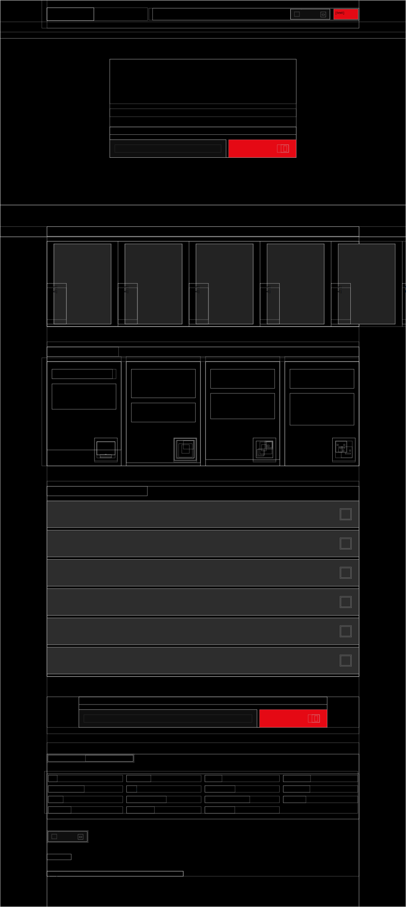

# NETFLIX Patterns

## Developer Instructions
This folder contains the UI patterns extracted from www_netflix_com. The `pages` folder contains the hierarchical DOM structure and computed styles (colors, layout) mapping to W3C Design Tokens.

### Layout Preview

### How to Utilize
1. Review `page-structure.json` for the bounding boxes and visual layout geometry.
2. Cross-reference the `screenshots` folder to understand the visual arrangement.
3. Implement these geometric and style layouts in your UI platform (React, Tailwind, HTML/CSS) replacing the structure with your own creative assets.
